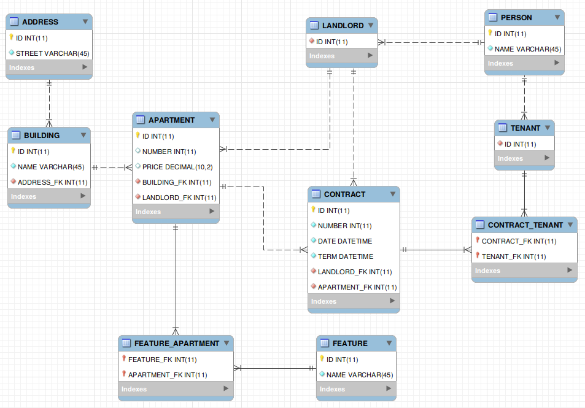

# zenhomes
Task 1: Doman Modelling 
Repository name: domain-<id> 

Please create the domain model for the following use cases: 
1) A landlord can rent out a separate apartment, the whole building or several apartments to another party. 
2) A landlord can sign a rental contract with one or multiple tenants. 
3) One tenant can rent multiple apartments from the same landlord. 
4) One tenant can rent multiple apartments simultaneously. 
5) A landlord can also be a tenant of another landlord. 

We suggest ER diagram as an outcome of this task but you can choose a format that makes more sense for you.

Figure 1: The ER diagram

Figure 2: The CD diagram
