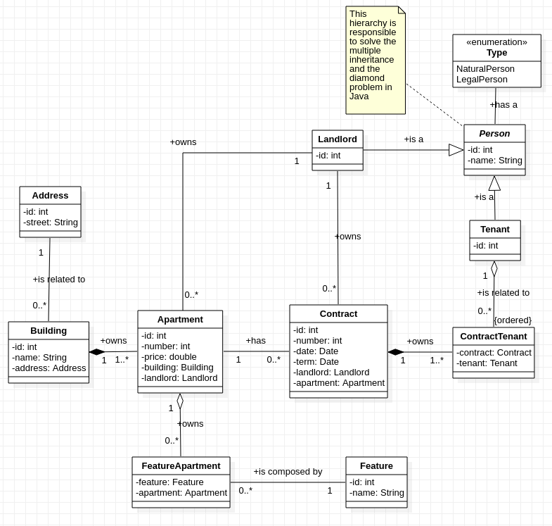

# zenhomes
**Task 1: Domain Modelling**
Repository name: domain-rent 

Please create the domain model for the following use cases: 
1) A landlord can rent out a separate apartment, the whole building or several apartments to another party. 
2) A landlord can sign a rental contract with one or multiple tenants. 
3) One tenant can rent multiple apartments from the same landlord. 
4) One tenant can rent multiple apartments simultaneously. 
5) A landlord can also be a tenant of another landlord. 

We suggest ER diagram as an outcome of this task but you can choose a format that makes more sense for you.

**Figure 1**: The Entity Relationship Diagram. The contract relation stores the transactions between landlord, apartment, and tenant. Besides, the hierachy person, landlord, and tenant is responsible to store the state of these objects. Furthermore, this structure allows to surpass the *Diamond Problem* and to store the state of objects and the behaviour on the class methods. As a result, it is possible to manage the *multiple inheritance*.

**Figure 2**: The Class Diagram. This diagram represents the oriented object model which allows to create a  object-relational mapping (ORM) and Validator by using a framework such as Hibernate. Moreover, this feature should be used to create a cache (by using a second cache lavel of Hibernate or a redis).

**Sources**
* [Hibernate](https://hibernate.org/)
* [Redis](https://redis.io/)

**Assumptions**
* The contracts of a complete building should generate a contract for each apartment. This allows for greater granularity management and impacts on any analytical models.
* The relationship between the landlord and the apartment, together with the contract, makes it possible to keep track of any changes in ownership.
* Attributes were kept as simple as possible to understand the relationship between model objects.
* This model was based on the following principles: (a) ubiquitous language, (b) bounded contexts, and (c) context maps.

**Test Case Suite**

There is a test case suite design by JUnit to test the use cases. To execute them, it is needs to have the Apache Maven and a Git client. To execute the tests, follow these steps:

1. git clone https://github.com/gomede/zenhomes-task1.git
2. mvn clean install

The result should be similar to the Figure 3 below.

**Figure 3**: The Test Case Suite' tests. To get more details, please open the com/zenhomes/app/AppTest.java.

**DDL and DML Test**

There is a DDL and DML script to test the Entity Relationship model. To execute them, it is needs the MySQL server and to perform the ddl.sql file (it is possible to use others DBMS such as Oracle, DB2, PostgreSQL, MSSQL, etc). In this file there is the commands to create a schema, relations, inserts, and a select to retrieval the data. An example of the information retrieval is shown in Figure 4.

**Figure 4**: An example of the information retrieval. It is possible build this using a framework such as Hibernate in many ways: (a) by mapping, (b) by criteria, (c) by HQL, (d) Native SQL, and (e) Named Queries.

The result (first row) is shown in Figure 5. This data should be used to populate the objects of object model.

**Figure 5**: The first row that result from the DML from Figure 4.

